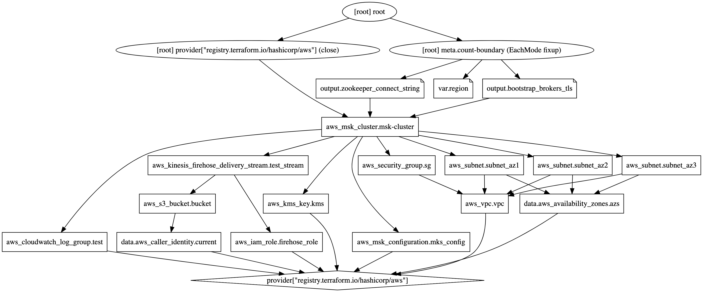

# Terraform / Amazon MSK

Terraform project for Amazon Managed Streaming for Apache Kafka (Amazon MSK). Original Terraform code based on
this [Terraform MSK Example](https://registry.terraform.io/providers/hashicorp/aws/latest/docs/resources/msk_cluster#example-usage)
.



## Setup

1. Deploy EKS cluster using eksctl;
2. Deploy MSK cluster and associated resources using Terraform;
3. Create VPC Peering relationship between MSK and EKS VPCs;
4. Update routing tables for both VPCs and associated subnets to route traffic to CIDR range of opposite VPC;
5. Update default VPC security groups to allow traffic;
6. Update MSK security group to allow access to MSK ports (e.g., 2181, 2182, 9092, 9094, 9098) from EKS VPC CIDR range (
   e.g., 192.168.0.0/16);
7. Create IAM Role for Service Accounts (IRSA) - allows access to MSK from EKS;
8. Deploy Tomcat-based Kafka client container using Helm;
9. Configure Kafka client container (see [Install-Kafka-Client.md](./Install-Kafka-Client.md));

## Helpful AWS CLI Commands for Amazon MSK

```shell
aws kafka list-clusters

aws kafka list-clusters --query 'ClusterInfoList[*].ClusterArn'

aws kafka describe-cluster --cluster-arn <YOUR_ARN_HERE>

# assuming cluster 0 (first or single cluster)
aws kafka describe-cluster --cluster-arn \
  $(aws kafka list-clusters --query 'ClusterInfoList[0].ClusterArn' --output text)
```

## Terraform

Deploy AWS MSK resources. PLEASE NOTE - this code creates two MSK clusters - one with and one without IAM. You can choose to deploy both or remove Terraform code for either one to prevent its creation.

```shell
cd ./tf-msk
terraform validate
terrafrom plan
terraform apply
```

## IAM Role for Service Account (IRSA)

```shell
export AWS_ACCOUNT=$(aws sts get-caller-identity --output text --query 'Account')
export EKS_REGION="us-east-1"
export CLUSTER_NAME="istio-observe-demo"

kubectl create namespace kafka

eksctl create iamserviceaccount \
  --name msk-serviceaccount \
  --namespace kafka \
  --region $EKS_REGION \
  --cluster $CLUSTER_NAME \
  --attach-policy-arn arn:aws:iam::$AWS_ACCOUNT:policy/KafkaClientAuthorizationPolicy \
  --approve \
  --override-existing-serviceaccounts

eksctl get iamserviceaccount --cluster $CLUSTER_NAME --namespace kafka
eksctl get iamserviceaccount msk-serviceaccount --cluster $CLUSTER_NAME --namespace kafka

# eksctl delete iamserviceaccount msk-serviceaccount --cluster $CLUSTER_NAME --namespace kafka
```

## Helm Chart

Create a EKS-based Kafka client container in an existing EKS cluster.

```shell
# perform dry run
helm install kafka-client ./kafka-client --namespace kafka --debug --dry-run

# apply chart resources
helm install kafka-client ./kafka-client --namespace kafka --create-namespace

# optional: update
helm upgrade kafka-client ./kafka-client --namespace kafka
```
