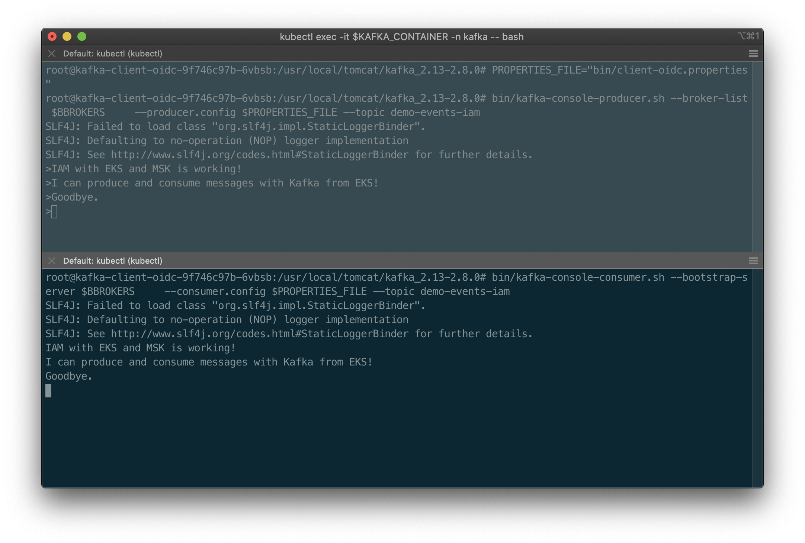

# Terraform, Amazon MSK, Amazon EKS Demo

Terraform project for using Amazon Managed Streaming for Apache Kafka (Amazon MSK) from Amazon Elastic Kubernetes Service (Amazon EKS).


## Setup

Assumes that you have eksctl, Terraform, AWS CLI v2, and Helm 3 installed.

1. Deploy EKS cluster using eksctl;
2. Deploy MSK cluster and associated resources using Terraform (see commands below);
3. Create VPC Peering relationship between MSK and EKS VPCs;
4. Update routing tables for both VPCs and associated subnets to route traffic to CIDR range of opposite VPC;
5. Update default VPC security groups to allow traffic;
6. Create IAM Roles for Service Accounts (IRSA) - allows access to MSK from EKS (see [Helm README](./kafka-client/README.md));
7. Deploy Tomcat-based Kafka client container using Helm (see [Helm README](./kafka-client/README.md));
8. Configure Kafka client container (see [Kafka Client Configuration Notes](kafka-config/Install-Kafka-Client.md));

## Helpful AWS CLI Commands for Amazon MSK

```shell
aws kafka list-clusters

aws kafka list-clusters --query 'ClusterInfoList[*].ClusterArn'

aws kafka describe-cluster --cluster-arn <YOUR_ARN_HERE>

# assuming cluster 0 (first or single cluster)
aws kafka describe-cluster --cluster-arn \
  $(aws kafka list-clusters --query 'ClusterInfoList[0].ClusterArn' --output text)
```

## Terraform

Deploy AWS MSK resources. PLEASE NOTE - this code creates two MSK clusters - one with and one without IAM. You can choose to deploy both or remove Terraform code for either one to prevent its creation.

Original Terraform reference code based on this [Terraform MSK Example](https://registry.terraform.io/providers/hashicorp/aws/latest/docs/resources/msk_cluster#example-usage).

```shell
cd ./tf-msk

terraform validate

terraform plan

terraform apply
```

## Results



---

<i>The contents of this repository represent my viewpoints and not of my past or current employers, including Amazon Web Services (AWS). All third-party libraries, modules, plugins, and SDKs are the property of their respective owners.</i>
