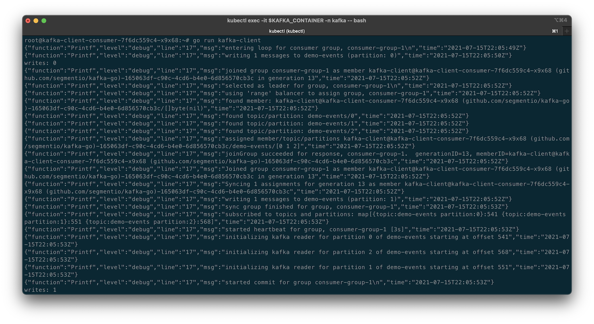

# Kafka Client Producer Demo App

## Test in Kubernetes Container without Compiling

### Code References

- <https://www.sohamkamani.com/golang/working-with-kafka/>
- <https://github.com/sohamkamani/golang-kafka-example/>
- <https://github.com/segmentio/kafka-go>

### Build and Push Docker Image

```shell
time docker build -t garystafford/kafka-producer-go:1.0.0 . --no-cache
docker push garystafford/kafka-producer-go:1.0.0
```

### Check Logs

```shell
export KAFKA_CONTAINER=$(kubectl get pods -n kafka -l app=kafka-consumer-go | awk 'FNR == 2 {print $1}')
kubectl logs $KAFKA_CONTAINER -n kafka
```

### Sample Output from Consumer


